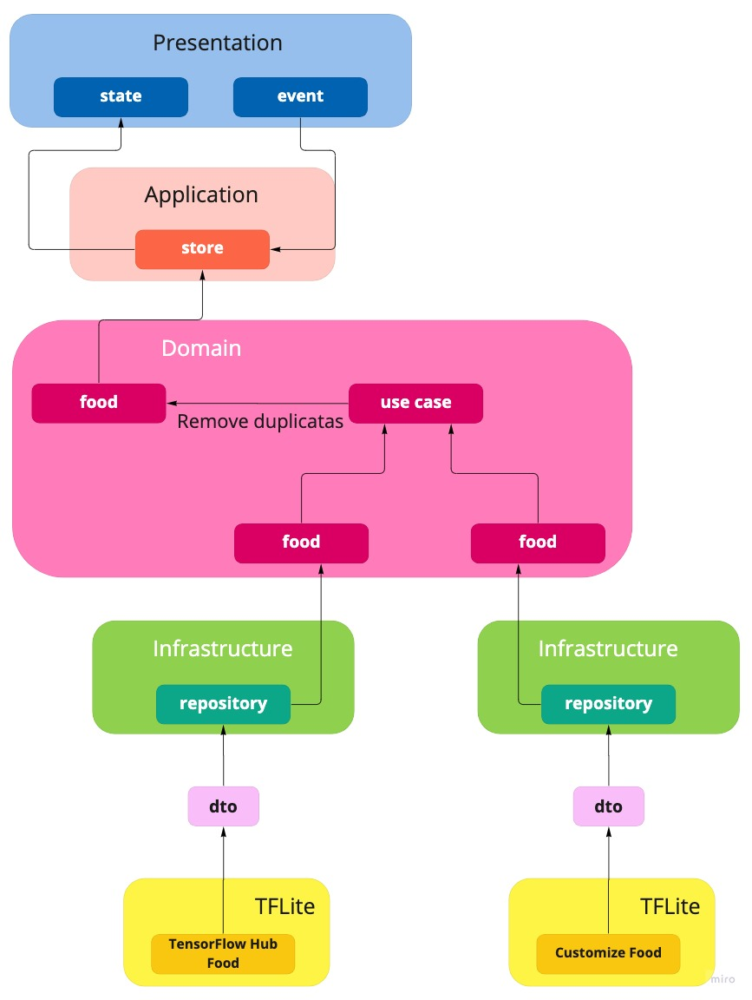
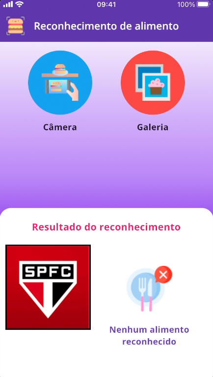

# Flutter food recognition apps

## O projeto

Esse projeto tem a proposta de reconhecer um alimento de acordo com a imagem de interesse, obtida através da câmera ou da galeria do dispositivo. Para isso foi utilizado o TensorFlow Lite, conjunto de ferramentas otimizado para machine learning em dispositivos, dentre estes os móveis, para executar seus modelos treinados. 

## Tecnologias/bibliotecas

Algumas das tecnologias/bibliotecas utilizadas na construção do aplicativo foram:

 - Flutter toolkit 3.0.2 (stable)
 - Dart 2.17.3
 - tflite: https://github.com/zhengbomo/flutter_tflite.git
 - equatable: 2.0.3
 - fpdart: 0.0.14
 - image_picker: 0.8.5+3
 - kt_dart: 0.10.0
 - provider: 6.0.3
 - dart_code_metrics 4.15.2
 - flutter_lints: 2.0.0
 - mocktail 0.3.0
 - value_listenable_test: 0.0.1
 - icons_launcher: 1.1.9
 - flutter_native_splash: 2.2.2

Além dessas, há também outras bibliotecas. O pubspec.yaml possui a lista completa das bibliotecas utilizadas.

## Considerações sobre a biblioteca tflite:

No momento em que esse projeto foi escrito, a biblioteca tflite apresenta inicialmente dois erros. Para corrigi-los, é necessário seguir os seguintes passos:

1. <strong>Could not build the precompiled application for the device. Lexical or Preprocessor Issue (Xcode): 'vector' file not found</strong>
- Abra o <strong>Xcode</strong>
- Selecione <strong>Runner</strong>
- Selecione <strong>Build Settings</strong>
- Selecione <strong>All</strong>
- Procure <strong>Apple Clang - Language</strong>
- Em <strong>Compile Sources As</strong>, escolha <em> Objective-C++ </em>

2. <strong>TFLite Error: "metal_delegate.h" File Not Found</strong>
- Vá para o diretório <strong>ios</strong> localizado no respectivo projeto
- Abra o arquivo <strong>Podfile.lock</strong>
- Substitua a linha <strong>- TensorFlowLiteC (2.7.0):</strong> por <strong>- TensorFlowLiteC (2.2.0):</strong>
- Ainda no diretório <strong>ios</strong>, execute o comando <em> pod install </em>

 Além desses erros, a documentação do tflite possui algumas outras recomendações de configuração. Para mais detalhes, consulte https://pub.dev/packages/tflite.

## TensorFlow Lite

Para um completo entendimento sobre o TensorFlow Lite, consulte a sua documentação oficial no endereço https://www.tensorflow.org/lite/guide?hl=pt-br.

Essa documentação contém uma explicação completa sobre esse conjunto de ferramentas, além de exemplos de códigos (em Python) para treinar seus próprios conjuntos de dados, tanto para reconhecimento de imagens, quanto para reconhecimento de objetos dentro de uma determinada imagem.

## Modelos utilizados

Para esse projeto, foram utilizados dois modelos:

### Modelo 1: TensorFlow Hub

O TensorFlow Hub é um repositório com alguns modelos já treinados. Dentre esses modelos, há um modelo de alimentos, disponível neste endereço https://tfhub.dev/google/lite-model/aiy/vision/classifier/food_V1/1.

Esse repositório disponibiliza duas versões do modelo. Uma para o Tensorflow e outra para o TensorFlow Lite. Inicialmente, foi realizado o download para o TensorFlow Lite.

#### Problema no Android

No entanto, durante o desenvolvimento, houve uma incompatibilidade do modelo do TensorFlow Lite com o aparelho Android utilizado, não sendo possível distinguir se esse problema ocorreu devido ao hardware (Samsung Galaxy J5), ou de versão do Android utilizado (Android 6.0.1). Talvez em dispositivos mais novos, com um Android mais recente, não tenha essa incompatibilidade. 

#### Solução

A solução encontrada foi realizar o download do modelo disponível para o TensorFlow e converter esse modelo para o TensorFlow Lite. Neste [link](https://stackoverflow.com/questions/65650859/converting-pretrained-model-from-tfhub-to-tflite
), retirado do Stack Overflow, há um exemplo de código, em Python, para realizar essa conversão.

Após essa conversão, o modelo gerado funcionou corretamente no dispositivo Android utilizado.

#### iOS

Para o iOS foram utilizados dois aparelhos: um iPhone 7, com o iOS 15.5 (mais recente até a escrita desse texto) e um iPhone 5 com o iOS 12.5.5 (mais recente nativamente disponível). Em ambos, o modelo do Tensorflow Lite originalmente baixado não apresentou incompatibilidade.

O modelo do TensorFlow convertido para TensorFlow Lite também não apresentou problema em nenhum dos dois iPhones.

### Modelo 2: Personalizado

Para o modelo personalizado, foram utilizados os seguintes repositórios:

- Food-101: https://www.kaggle.com/datasets/dansbecker/food-101
- Food-5k: https://www.kaggle.com/code/gauravsingh143/food-5k/data
- Food-11: https://www.kaggle.com/datasets/vermaavi/food11
- Foodx-251: https://paperswithcode.com/dataset/foodx-251
- Fruits 360: https://www.kaggle.com/datasets/moltean/fruits
- MyFood: https://paperswithcode.com/dataset/myfood-dataset
- Salads_ML_Use: https://cloud.google.com/vision/automl/object-detection/docs/label-images-api?hl=nb

#### Tratamento dos dados

Depois de baixados, os nomes passaram por uma normalização automática, com as seguintes modificações:

- Substituição de espaços em branco por under
- Substituição de hífen por under
- Remoção de caracteres especiais
- Remoção de acentos
- Remoção de under no início do nome
- Remoção de under no final do nome
- Troca de letras maíusculas por minúsculas

Além disso, houve uma curadoria manual para:

- Normalizar variações, como o plural
- Correção de sintaxe, de acordo com o repositório, como, por exemplo:
   - uma mesma comida escrita ora com i e ora com y
   - a falta ou a sobra de alguma letra

Por fim, todos os dados dos repositórios foram unidos em um único local, sendo a entrada do script desenvolvido para gerar o modelo treinado.

#### O modelo treinado

O script construído para gerar o modelo treinado foi baseado na seguinte documentação: https://www.tensorflow.org/lite/models/modify/model_maker/image_classification.

Nesse treinamento há algumas características a serem consideradas:
 - Quantificação de dados:
    - Imagens de treinamento: <strong>273.458</strong>
    - Imagens de validação: <strong>41.199</strong>
    - Imagens de teste: <strong>54.937</strong>
    - Total de imagens: <strong>369.594</strong>
- Modelo: <strong>mobilenet_v2</strong>
- Epochs: <strong>1</strong>. Quanto maior o epochs, melhor é a precisão. Devido a grande quantidade de imagens a serem treinadas e as retrições de hardware do computador usado, o número de epochs foi o mínimo possível.
- Quantização pós-treinamento: <strong>float16</strong>

## A aplicação

### A arquitetura

A figura abaixo ilustra a arquitetura da aplicação.

No fluxo da arquitetura dessa figura, o TFlite, ao analisar a imagem escolhida pelo usuário, retorna o resultado encontrado para o repositório, através de um dto. 

O repositório, por sua vez, retorna a entidade para o use case. É nesse fluxo que se faz necessário uma explicação mais detalhada. Podemos reparar as duas ramificações chegando ao use case. Na primeira, o repositório recebe os resultados obtidos através do modelo do TensorFlow Hub e, na segunda ramificação, o repositório recebe os resultados do modelo personalizado.

Essas ramificações não significa que há dois repositórios distintos implementados, nem dois dtos distintos implementados. Há apenas uma implementação de ambos, e a distinção acontece pela injeção de dependência do modelo de interesse do TFLite no construtor do repositório.

As ramificações representam que ambos os modelos são utilizados ao mesmo tempo. Ou seja, são complementares e não mutuamente exclusivos. No final, cada repositório da ramificação retorna a identificação da imagem de acordo com o respectivo modelo. O use case, ao receber esses resultados, verifica se há duplicidade, ou seja, identidades repetidas, e quem estiver com a maior pontuação será mantido.

Por fim, o retorno do use case será armazenado no store, que usa o ValueNotifier como gerência de estados, refletindo essa mudança de estado para o usuário, de acordo com cada ação (ou evento) de submissão da imagem escolhida para reconhecimento.

### Usabilidade

A usabilidade é bem simples. Basta escolher uma imagem de comida, através de uma foto tirada na hora usando a câmera, ou através de uma imagem já salva no dispositivo e o reconhecimento da foto será realizada automaticamente e os resultados serão exibidos ao usuário.

<table>
  <tr>
    <td>
      

        
      

      

        iPhone 7
      

    </td>
    <td>
      

        
      

      

        iPhone 5
      

    </td>
    <td>
      

        
      

      

        Samsung Galaxy J5
      

    </td>
  </tr>
  <tr>
    <td>
      

        
      

      

        Nenhum alimento reconhecido
      

    </td>
  </tr>
</table>

### Tradução dos nomes

Originalmente os nomes das comidas são estabelecidos pelos respectivos repositórios, incluindo o modelo disponível pelo TensorFlow Hub.

Começando pela língua inglesa, já que todos os repositórios utilizados são de fora. Houve uma tentativa de obter dados do Brasil na época da coleta, porém não foi encontrado nada viável para comida brasileira.

A curadoria foi realizada em duas etapas: 

#### Translate do Google Cloud

A primeira etapa foi a tradução automática para o português. Para isso foi utlizado a api [translation do Google Cloud](https://cloud.google.com/translate/?utm_source=google&utm_medium=cpc&utm_campaign=latam-BR-all-pt-dr-BKWS-all-all-trial-e-dr-1011454-LUAC0014873&utm_content=text-ad-none-any-DEV_c-CRE_547331812054-ADGP_Hybrid%20%7C%20BKWS%20-%20EXA%20%7C%20Txt%20~%20AI%20%26%20ML_Translation-KWID_43700071228558735-kwd-166600839370&utm_term=KW_google%20cloud%20translate-ST_google%20cloud%20translate&gclid=Cj0KCQjw-pCVBhCFARIsAGMxhAdcEtZOTp6zZV7IcmT_OAS0I3hEhb6JFH_gfD0XRjKS2KspZ5fnvw8aAj_YEALw_wcB&gclsrc=aw.ds). O uso dessa api foi através da construção de um script Python, usando a biblioteca [translate_v2 do pacote google.cloud](https://cloud.google.com/translate/docs/basic/translating-text#translate_translate_text-python). Resumidamente, o uso dessa api requer os seguintes passos:
 - Criar uma conta na plataforma do Google 
 - Criar um projeto 
 - Cadastrar dados pessoais, incluindo o cartão de crédito, pois o uso dessa api não é completamente gratuita, apesar de uma tolerância para o uso gratuito (primeiros 500.000 caracteres por mês)
 - Criar uma chave de acesso
 - Baixar um arquivo no formato JSON com as credenciais de acesso
 - Criar uma variável de ambiente chamado GOOGLE_APPLICATION_CREDENTIALS com o caminho do arquivo JSON baixado

 #### Curadoria manual

 A segunda etapa foi uma curadoria manual, verificando se a tradução foi realizada corretamente, ou se o sentido da tradução foi mantido ou modificado em relação ao nome original do alimento. 
 
 Por exemplo, no Brasil muitas comidas oriundas de fora não possuem tradução, sendo chamadas pelo nome original. Nesse caso, uma tradução literal retira completamente o sentido do alimento.

## Diferentes propostas

A proposta desse projeto é reconhecer um alimento de acordo com a imagem de interesse. No entanto, o uso do TFLite abre a possibilidade de estender o projeto para outros tipos de reconhecimentos como, por exemplo, tipos de veículos, arquiteturas ou objetos diversos.

Para isso, basta apenas entrar com o respectivo modelo treinado de interesse, seja por parâmetro de função, por propriedade de classe, passando o modelo na instância do objeto ou até mesmo uma classe específica, com a definição do modelo de forma estática e realizando a sua injeção na classe de interesse, como foi implementado o projeto.

Além do reconhecimento de imagem, o TFLite também possibilita o reconhecimento de objetos dentro uma imagem e até mesmo reconhecimento de voz. Ou seja, existe uma gama de possibilidades de aplicações a serem construídas com os mais diversos propósitos e objetivos, ficando a cargo dos interesses e criatividade do desenvolvedor.

## Imagens do aplicativo

Icons made by <a href="https://www.freepik.com" title="Freepik">Freepik</a> from <a href="https://www.flaticon.com/" title="Flaticon">www.flaticon.com</a>
